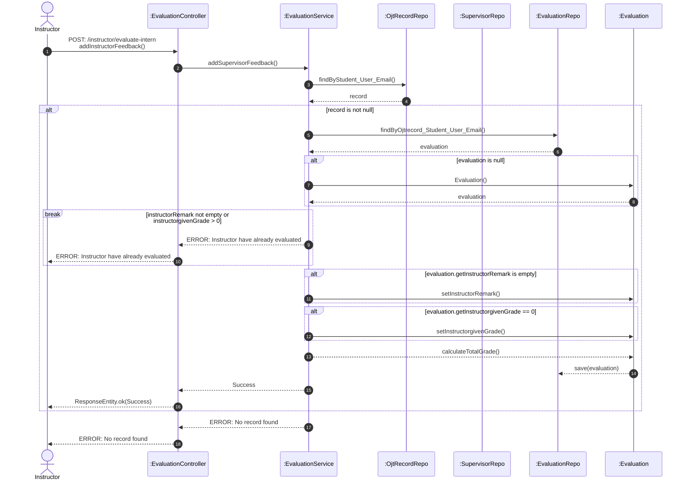

```mermaid
sequenceDiagram
    autonumber
    actor i as Instructor
    participant ec as :EvaluationController
    participant es as :EvaluationService
    participant or as :OjtRecordRepo
    participant sr as :SupervisorRepo
    participant er as :EvaluationRepo
    participant e as :Evaluation
    i->>ec: POST: /instructor/evaluate-intern<br>addInstructorFeedback()
    ec->>es: addSupervisorFeedback()
    es->>or: findByStudent_User_Email()
    or-->>es: record
    alt record is not null
        es->>er: findByOjtrecord_Student_User_Email()
        er-->>es: evaluation
        alt evaluation is null
            es->>e: Evaluation()
            e-->>es: evaluation
        end
        break instructorRemark not empty or instructorgivenGrade > 0
            es-->>ec: ERROR: Instructor have already evaluated
            ec-->>i: ERROR: Instructor have already evaluated
        end
        alt evaluation.getInstructorRemark is empty
                es->>e: setInstructorRemark()
            end
            alt evaluation.getInstructorgivenGrade == 0
                es->>e: setInstructorgivenGrade()
            end
            es-->>e: calculateTotalGrade()
            e-->>er: save(evaluation)
            es-->>ec: Success
            ec-->>i: ResponseEntity.ok(Success)
        end
    es-->>ec: ERROR: No record found
    ec-->>i: ERROR: No record found
```
