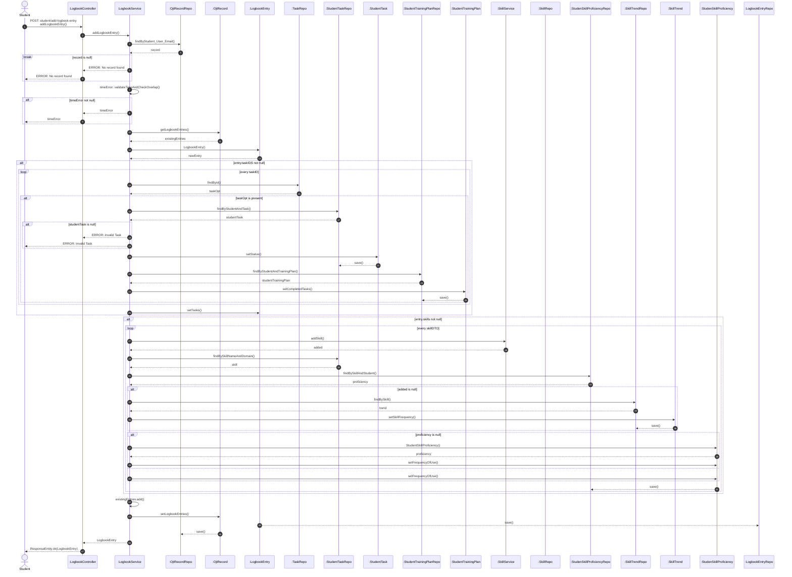

```mermaid
sequenceDiagram
    autonumber
    actor s as Student
    participant lc as :LogbookController
    participant ls as :LogbookService
    participant or as :OjtRecordRepo
    participant o as :OjtRecord
    participant le as :LogbookEntry
    participant tr as :TaskRepo
    participant str as :StudentTaskRepo
    participant st as :StudentTask
    participant stpr as :StudentTrainingPlanRepo
    participant stp as :StudentTrainingPlan
    participant ss as :SkillService
    participant sk as :SkillRepo
    participant sspr as :StudenSkillProficiencyRepo
    participant sktr as :SkillTrendRepo
    participant skt as :SkillTrend
    participant ssp as :StudenSkillProficiency
    participant ler as :LogbookEntryRepo
    s->>lc: POST: student/add-logbook-entry<br>addLogbookEntry()
    lc->>ls: addLogbookEntry()
    ls->>or: findByStudent_User_Email()
    or-->>ls: record
    break record is null
        ls-->>lc: ERROR: No record found
        lc-->>s: ERROR: No record found
    end
    ls->>ls: timeError: validateTimeAndCheckOverlap()
    alt timeError not null
        ls-->>lc: timeError
        lc-->>s: timeError
    end
    ls->>o: getLegbookEntries()
    o-->>ls: existingEntries
    ls->>le: LogbookEntry()
    le-->>ls: newEntry
    alt entry.taskIDS not null
        loop every taskID
            ls->>tr: findById()
            tr-->>ls: taskOpt
            alt taskOpt is present
                ls->>str: findByStudentAndTask()
                str-->>ls: studentTask
                alt studentTask is null
                    ls-->>lc: ERROR: Invalid Task
                    ls-->>s: ERROR: Invalid Task
                end
                ls->>st: setStatus()
                st-->>str: save()
                ls->>stpr: findByStudentAndTrainingPlan()
                stpr-->>ls: studentTrainingPlan
                ls->>stp: setCompletedTasks()
                stp-->>stpr: save()
            end
        end
        ls->>le: setTasks()
    end 
    alt entry.skills not null
        loop every skillDTO
            ls->>ss: addSkill()
            ss-->>ls: added
            ls->>str: findBySkillNameAndDomain()
            str-->>ls: skill
            ls->>sspr: findBySkillAndStudent()
            sspr-->>ls: proficiency
            alt added is null
                ls->>sktr: findBySkill()
                sktr-->>ls: trend
                ls->>skt: setSkillFrequency()
                skt-->>sktr: save()
            end
            alt proficiency is null
                ls->>ssp: StudentSkillProficiency()
                ssp-->>ls: proficiency
                ls->>ssp: setFrequencyOfUse()
            else
                ls->>ssp: setFrequencyOfUse()
            end
            ssp-->>sspr: save()
        end
    end
    ls->>ls: existingEntries.add()
    ls->>o: setLogbookEntries()
    le-->>ler: save()
    o-->>or: save()
    ls-->>lc: LogbookEntry
    lc-->>s: ResponseEntity.ok(LogbookEntry)
```