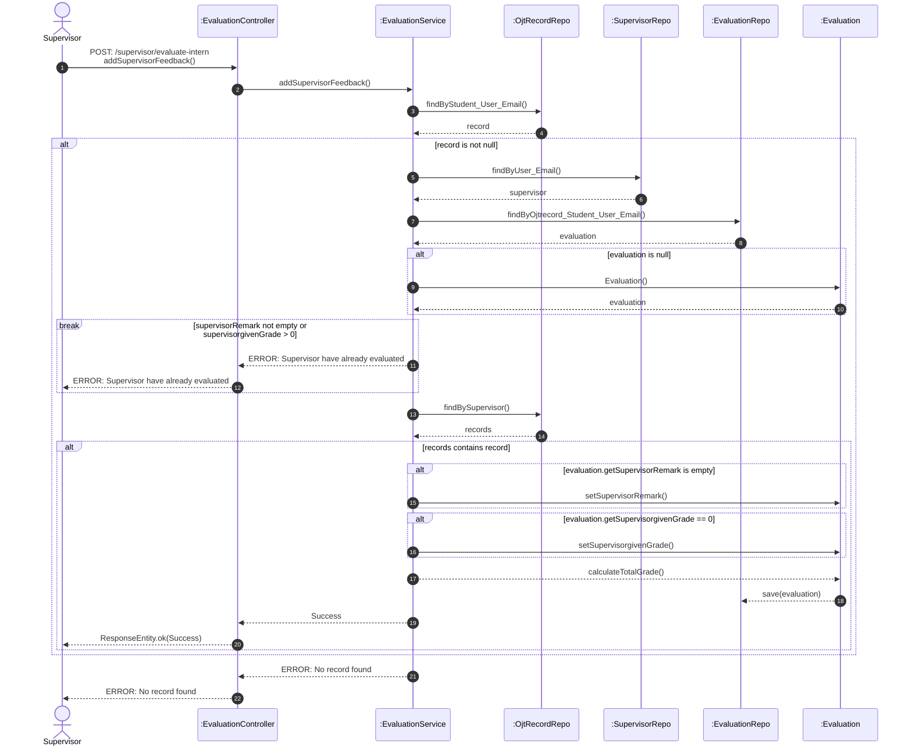

```mermaid
sequenceDiagram
    autonumber
    actor s as Supervisor
    participant ec as :EvaluationController
    participant es as :EvaluationService
    participant or as :OjtRecordRepo
    participant sr as :SupervisorRepo
    participant er as :EvaluationRepo
    participant e as :Evaluation
    s->>ec: POST: /supervisor/evaluate-intern<br>addSupervisorFeedback()
    ec->>es: addSupervisorFeedback()
    es->>or: findByStudent_User_Email()
    or-->>es: record
    alt record is not null
        es->>sr: findByUser_Email()
        sr-->>es: supervisor
        es->>er: findByOjtrecord_Student_User_Email()
        er-->>es: evaluation
        alt evaluation is null
            es->>e: Evaluation()
            e-->>es: evaluation
        end
        break supervisorRemark not empty or supervisorgivenGrade > 0
            es-->>ec: ERROR: Supervisor have already evaluated
            ec-->>s: ERROR: Supervisor have already evaluated
        end
        es->>or: findBySupervisor()
        or-->>es: records
        alt records contains record
            alt evaluation.getSupervisorRemark is empty
                es->>e: setSupervisorRemark()
            end
            alt evaluation.getSupervisorgivenGrade == 0
                es->>e: setSupervisorgivenGrade()
            end
            es-->>e: calculateTotalGrade()
            e-->>er: save(evaluation)
            es-->>ec: Success
            ec-->>s: ResponseEntity.ok(Success)
        end
    end
    es-->>ec: ERROR: No record found
    ec-->>s: ERROR: No record found
```