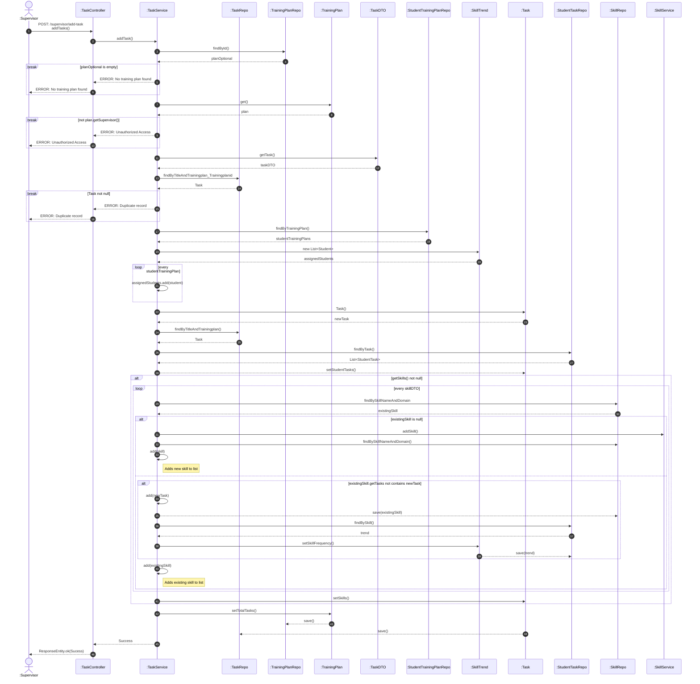

```mermaid
sequenceDiagram
    autonumber
    actor s as :Supervisor
    participant tc as :TaskController
    participant ts as :TaskService
    participant tr as :TaskRepo
    participant tpr as :TrainingPlanRepo
    participant tp as :TrainingPlan
    participant td as :TaskDTO
    participant stpr as :StudentTrainingPlanRepo
    participant st as :Student
    participant t as :Task
    participant str as :StudentTaskRepo
    participant sr as :SkillRepo
    participant ss as :SkillService
    participant st as :SkillTrend
    s->>tc: POST: /supervisor/add-task<br>addTasks()
    tc->>ts: addTask()
    ts->>tpr: findById()
    tpr-->>ts: planOptional
    break planOptional is empty
        ts-->>tc: ERROR: No training plan found
        tc-->>s: ERROR: No training plan found
    end
    ts->>tp: get()
    tp-->>ts: plan
    break not plan.getSupervisor()
        ts-->>tc: ERROR: Unauthorized Access
        tc-->>s: ERROR: Unauthorized Access
    end
    ts->>td: getTask()
    td-->>ts: taskDTO
    ts->>tr: findByTitleAndTrainingplan_Trainingplanid
    tr-->>ts: Task
    break Task not null
        ts-->>tc: ERROR: Duplicate record
        tc-->>s: ERROR: Duplicate record
    end
    ts->>stpr: findByTrainingPlan()
    stpr-->>ts: studentTrainingPlans
    ts->>st: new List<Student>
    st-->>ts: assignedStudents
    loop every studentTrainingPlan
        ts->>ts: assignedStudents.add(student)
    end
    ts->>t: Task()
    t-->>ts: newTask
    ts->>tr: findByTitleAndTrainingplan()
    tr-->>ts: Task
    ts->>str: findByTask()
    str-->>ts: List<StudentTask>
    ts-->>t: setStudentTasks()
    alt getSkills() not null
        loop every skillDTO
            ts->>sr: findBySkillNameAndDomain
            sr-->>ts: existingSkill
            alt existingSkill is null
                ts->>ss: addSkill()
                ts->>sr: findBySkillNameAndDomain()
                ts->>ts: add(skill)
                Note right of ts: Adds new skill to list
            else 
                alt existingSkill.getTasks not contains newTask
                    ts->>ts: add(newTask)
                    ts-->>sr: save(existingSkill)
                    ts->>str: findBySkill()
                    str-->>ts: trend
                    ts->>st: setSkillFrequency()
                    st-->>str: save(trend)
                end
                ts->>ts: add(existingSkill)
                Note right of ts: Adds existing skill to list
            end
        end
        ts->>t: setSkills()
    end
    ts->>tp: setTotalTasks()
    tp-->>tpr: save()
    t-->>tr: save()
    ts-->>tc: Success
    tc-->>s: ResponseEntity.ok(Sucess)
```