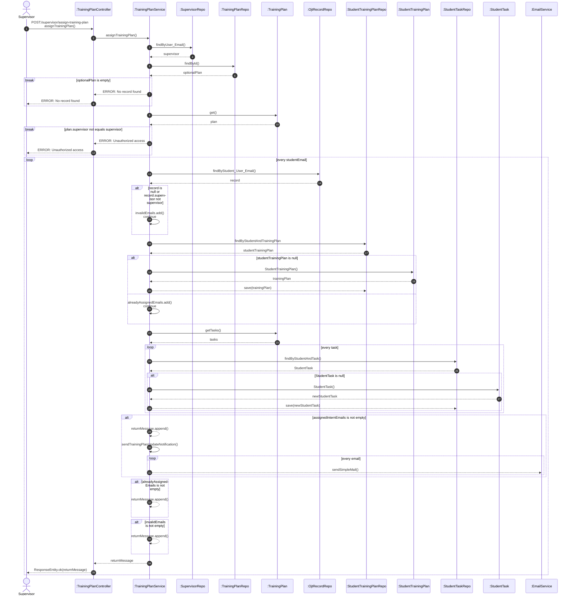

```mermaid
sequenceDiagram
    autonumber
    actor s as Supervisor
    participant tpc as :TrainingPlanController
    participant tps as :TrainingPlanService
    participant sr as :SupervisorRepo
    participant tpr as :TrainingPlanRepo
    participant tp as :TrainingPlan
    participant or as :OjtRecordRepo
    participant stpr as :StudentTrainingPlanRepo
    participant stp as :StudentTrainingPlan
    participant str as :StudentTaskRepo
    participant st as :StudentTask
    participant es as :EmailService
    s->>tpc: POST:/supervisor/assign-training-plan<br>assignTrainingPlan()
    tpc->>tps: assignTrainingPlan()
    tps->>sr: findByUser_Email()
    sr-->>tps: supervisor
    tps->>tpr: findById()
    tpr-->>tps: optionalPlan
    break optionalPlan is empty
        tps-->>tpc: ERROR: No record found
        tpc-->>s: ERROR: No record found
    end
    tps->>tp: get()
    tp-->>tps: plan
    break plan.supervisor not equals supervisor
        tps-->>tpc: ERROR: Unauthorized access
        tpc-->>s: ERROR: Unauthorized access
    end
    loop every studentEmail
        tps->>or: findByStudent_User_Email()
        or-->>tps: record
        alt record is null or record.supervisor not supervisor
            tps->>tps: invalidEmails.add()<br>continue
        end
        tps->>stpr: findByStudentAndTrainingPlan
        stpr-->>tps: studentTrainingPlan
        alt studentTrainingPlan is null
            tps->>stp: StudentTrainingPlan()
            stp-->>tps: trainingPlan
            tps-->>stpr: save(trainingPlan)
        else
            tps->>tps: alreadyAssignedEmails.add()<br>continue
        end
        tps->>tp: getTasks()
        tp-->>tps: tasks
        loop every task
            tps->>str: findByStudentAndTask()
            str-->>tps: StudentTask
            alt StudentTask is null
                tps->>st: StudentTask()
                st-->>tps: newStudentTask
                tps-->>str: save(newStudentTask)
            end
        end
        alt assignedInternEmails is not empty
            tps-->>tps: returnMessage.append()
            tps->>tps: sendTrainingPlanUpdateNotification()
            loop every email
                tps-->>es: sendSimpleMail()
            end
        end
        alt alreadyAssignedEmails is not empty
            tps-->>tps: returnMessage.append()
        end
        alt invalidEmails is not empty
            tps-->>tps: returnMessage.append()
        end
        tps-->>tpc: returnMessage
        tpc-->>s: ResponseEntity.ok(returnMessage)
    end
```