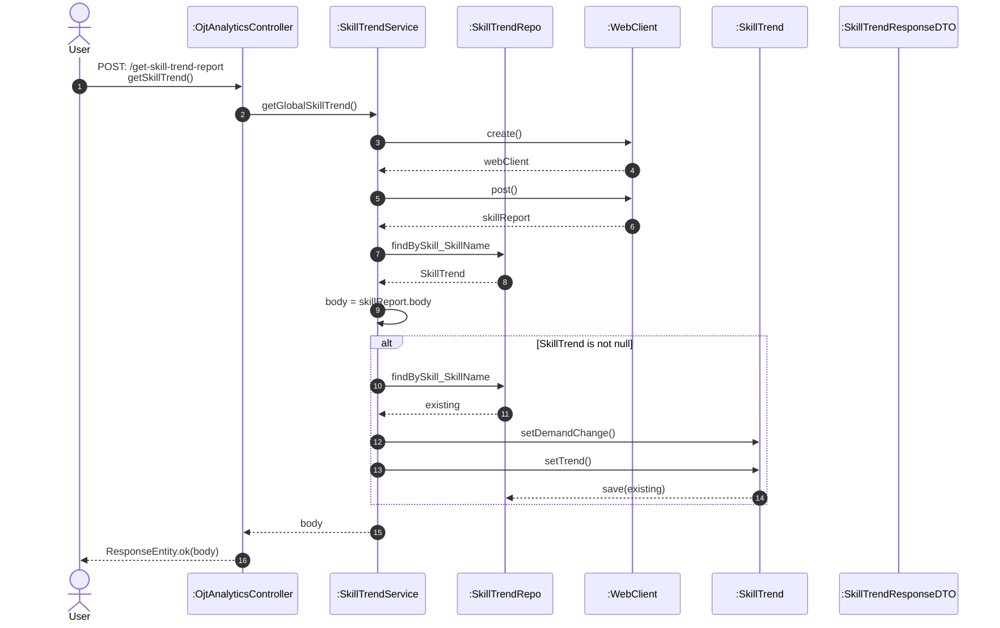

```mermaid
sequenceDiagram
    autonumber
    actor u as User
    participant oac as :OjtAnalyticsController
    participant sts as :SkillTrendService
    participant str as :SkillTrendRepo
    participant wc as :WebClient
    participant str as :SkillTrendRepo
    participant st as :SkillTrend
    participant strd as :SkillTrendResponseDTO
    u->>oac: POST: /get-skill-trend-report<br>getSkillTrend()
    oac->>sts: getGlobalSkillTrend()
    sts->>wc: create()
    wc-->>sts: webClient
    sts->>wc: post()
    wc-->>sts: skillReport
    sts->>str: findBySkill_SkillName
    str-->>sts: SkillTrend
    sts->>sts: body = skillReport.body
    alt SkillTrend is not null
        sts->>str: findBySkill_SkillName
        str-->>sts: existing
        sts->>st: setDemandChange()
        sts->>st: setTrend()
        st-->>str: save(existing)
    end
    sts-->>oac: body
    oac-->>u: ResponseEntity.ok(body)
```