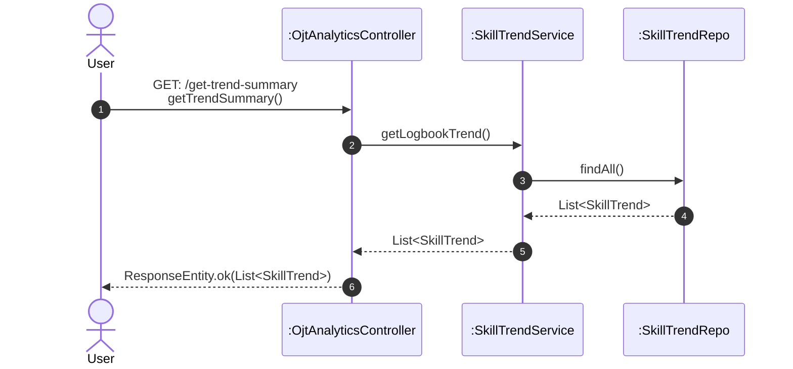

```mermaid
sequenceDiagram
    autonumber
    actor u as User
    participant oac as :OjtAnalyticsController
    participant sts as :SkillTrendService
    participant str as :SkillTrendRepo
    u->>oac: GET: /get-trend-summary<br>getTrendSummary()
    oac->>sts: getLogbookTrend()
    sts->>str: findAll()
    str-->>sts: List<SkillTrend>
    sts-->>oac: List<SkillTrend>
    oac-->>u: ResponseEntity.ok(List<SkillTrend>)
```