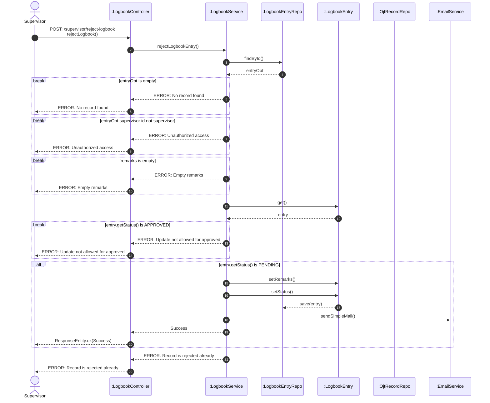

```mermaid
sequenceDiagram
    autonumber
    actor s as Supervisor
    participant lc as :LogbookController
    participant ls as :LogbookService
    participant lr as :LogbookEntryRepo
    participant le as :LogbookEntry
    participant or as :OjtRecordRepo
    participant es as :EmailService
    s->>lc: POST: /supervisor/reject-logbook<br>rejectLogbook()
    lc->>ls: rejectLogbookEntry()
    ls->>lr: findById()
    lr-->>ls: entryOpt
    break entryOpt is empty
        ls-->>lc: ERROR: No record found
        lc-->>s: ERROR: No record found
    end
    break entryOpt.supervisor id not supervisor
        ls-->>lc: ERROR: Unauthorized access
        lc-->>s: ERROR: Unauthorized access
    end
    break remarks is empty
        ls-->>lc: ERROR: Empty remarks
        lc-->>s: ERROR: Empty remarks
    end
    ls->>le: get()
    le-->>ls: entry
    break entry.getStatus() is APPROVED
        ls-->>lc: ERROR: Update not allowed for approved
        lc-->>s: ERROR: Update not allowed for approved
    end
    alt entry.getStatus() is PENDING
        ls->>le: setRemarks()
        ls->>le: setStatus()
        le-->>lr: save(entry)
        ls-->>es: sendSimpleMail()
        ls-->>lc: Success
        lc-->>s: ResponseEntity.ok(Success)
    end
    ls-->>lc: ERROR: Record is rejected already
    lc-->>s: ERROR: Record is rejected already
```