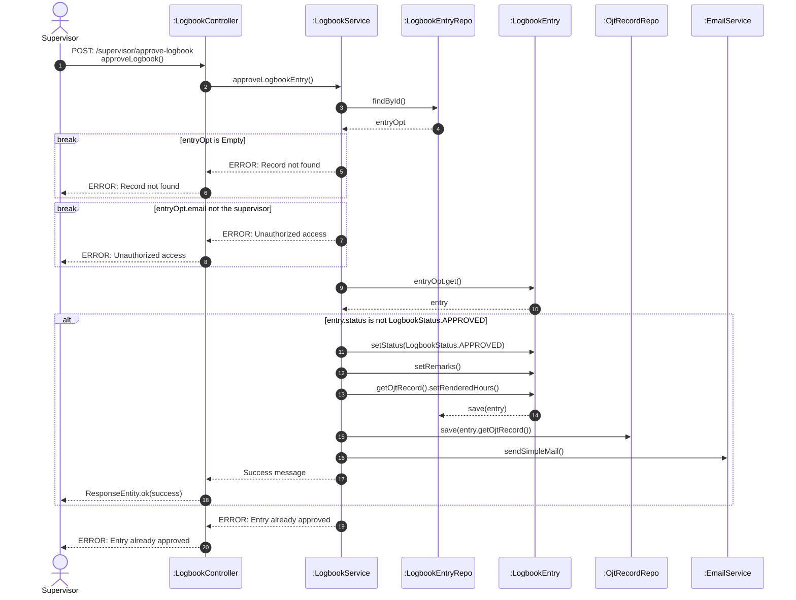

```mermaid
sequenceDiagram
    autonumber
    actor s as Supervisor
    participant lc as :LogbookController
    participant ls as :LogbookService
    participant lr as :LogbookEntryRepo
    participant le as :LogbookEntry
    participant or as :OjtRecordRepo
    participant es as :EmailService
    s->>lc: POST: /supervisor/approve-logbook<br>approveLogbook()
    lc->>ls: approveLogbookEntry()
    ls->>lr: findById()
    lr-->>ls: entryOpt 
    break entryOpt is Empty
        ls-->>lc: ERROR: Record not found
        lc-->>s: ERROR: Record not found
    end
    break entryOpt.email not the supervisor
        ls-->>lc: ERROR: Unauthorized access
        lc-->>s: ERROR: Unauthorized access
    end
    ls->>le: entryOpt.get()
    le-->>ls: entry
    alt entry.status is not LogbookStatus.APPROVED
        ls->>le: setStatus(LogbookStatus.APPROVED)
        ls->>le: setRemarks()
        ls->>le: getOjtRecord().setRenderedHours()
        le-->>lr: save(entry)
        ls->>or: save(entry.getOjtRecord())
        ls->>es: sendSimpleMail()
        ls-->>lc: Success message
        lc-->>s: ResponseEntity.ok(success)
    end
    ls-->>lc: ERROR: Entry already approved
    lc-->>s: ERROR: Entry already approved
```